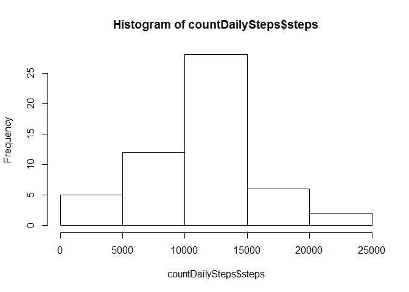
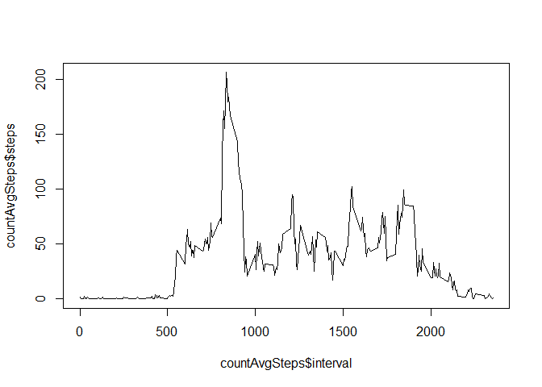
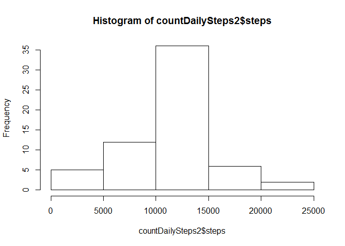
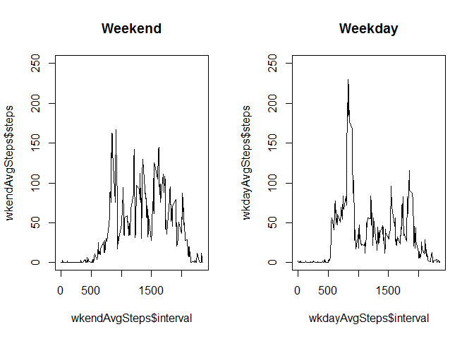

# Reproducible Research: Peer Assessment 1

author: Rich He

date: 8/17/2014

## Loading and preprocessing the data
As the data given in this asignment is in csv format, it's straight forward to use read.csv() to load the file. There is no need any preprocessing at this point.

```r
fileName <- "./activity.csv"
dat <- read.csv(fileName)
```

## What is mean total number of steps taken per day?

```r
countDailySteps <- aggregate(steps~date,dat,sum)
hist(countDailySteps$steps)
```

 


```r
mean(countDailySteps[,2])
```

```
## [1] 10766
```

```r
median(countDailySteps[,2])
```

```
## [1] 10765
```
There is only one step difference between mean and median steps per day.


## What is the average daily activity pattern?

```r
countAvgSteps <- aggregate(steps~interval,dat,mean)
plot(countAvgSteps$interval, countAvgSteps$steps,type='l')
```

 

From the above plot, there is a peak which shows the maximum steps in 5 minutes across the whole day. We would like to find when this happened during the day and how exactly active it is.

```r
max(countAvgSteps$steps)
```

```
## [1] 206.2
```

```r
p <- which(countAvgSteps$steps == max(countAvgSteps$steps))
countAvgSteps$interval[p]
```

```
## [1] 835
```

The above calculation shows the most active time during the day is 8:35am with 206 steps. 

## Imputing missing values
To fix missing values, we need to find out exactly how many values are missing.

```r
naIndex <- which(is.na(dat)==TRUE)
length(naIndex)
```

```
## [1] 2304
```

There are 2304 missing values in our data.

We need to devise a strategy to imput the missing values. We have two options,

  + option 1: use the mean/median for that day

  + option 2: use the mean for that 5-minute interval

I applied option 2 in this analysis, because it makes more sense to me

```r
newDat <- dat

for (i in 1:length(naIndex)){
    
  pos <- naIndex[i]

  meanPos <- which(countAvgSteps$interval==newDat[pos,3])
  
  newDat[pos,1] <- countAvgSteps$steps[meanPos]  
}
countDailySteps2 <- aggregate(steps~date,newDat,sum)
hist(countDailySteps2$steps)
```

 

After the missing values were fixed, we found there is no difference between mean and median. Both are 10766. 

```r
mean(countDailySteps2[,2])
```

```
## [1] 10766
```

```r
median(countDailySteps2[,2])
```

```
## [1] 10766
```

## Are there differences in activity patterns between weekdays and weekends?
To find the difference, we need to subset out data into two categories - weekdays and weekends.

```r
dates <- as.POSIXct(newDat$date)
wkday <- weekdays(dates)
wkendIdx <- which(wkday=="Saturday"|wkday=="Sunday")
wkendDat <- newDat[wkendIdx,]
wkdayDat <- newDat[-wkendIdx,]

wkendAvgSteps <- aggregate(steps~interval,wkendDat,mean)
wkdayAvgSteps <- aggregate(steps~interval,wkdayDat,mean)
```
After subset out data into weekdays and weekends, we can plot them side by side. Based on initial visual checking, generally speaking, there are more activity during the daytime on weekends than on weekdays, although the peak activity on weekends is not as intense as on weekdays.

```r
par(mfrow = c(1,2))
plot(wkendAvgSteps$interval, wkendAvgSteps$steps,type="l",main="Weekend",ylim=range(1:250))
plot(wkdayAvgSteps$interval, wkdayAvgSteps$steps,type="l",main="Weekday",ylim=range(1:250))
```

 
